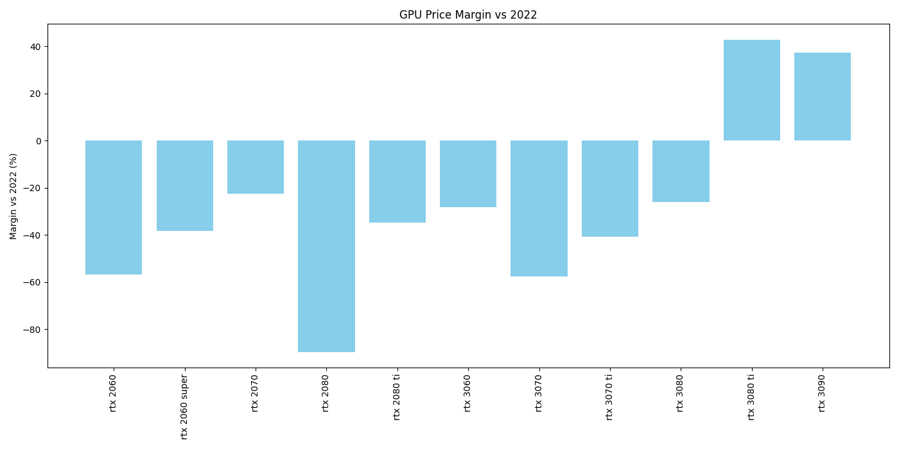
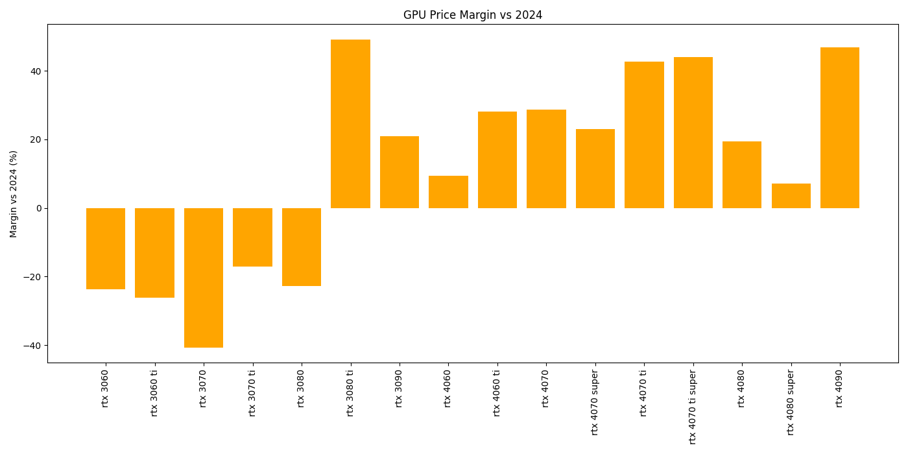

# Web Scraping GPU Price Project

## Deskripsi Proyek
Proyek ini bertujuan untuk mengumpulkan, menganalisis, dan memvisualisasikan data harga GPU (Graphics Processing Unit) dari berbagai sumber online, khususnya marketplace Indonesia seperti Tokopedia dan Klikgalaxy, serta membandingkan dengan harga historis dan MSRP (harga ritel resmi).

### Fitur Utama
- **Scraping Data Harga GPU**: Mengambil data harga GPU terbaru dari Tokopedia dan Klikgalaxy menggunakan script Python (BeautifulSoup, requests).
- **Pengolahan Data**: Menggabungkan data dari berbagai sumber, melakukan normalisasi nama model, dan menghitung rata-rata harga untuk setiap model GPU.
- **Analisis Margin Harga**: Membandingkan harga saat ini dengan harga historis (2022, 2024) dan MSRP untuk mengetahui margin atau selisih harga.
- **Visualisasi**: Menampilkan grafik perbandingan harga GPU dari waktu ke waktu dan antar sumber.
- **Scraping MSRP**: Mengambil data MSRP dari situs Tom’s Hardware untuk RTX 40/50 series secara otomatis.

## Struktur File
- `scrape_tokopedia.py`, `scrape_klikgalaxy.py`: Script scraping harga GPU dari marketplace.
- `gpu_data_toped.csv`, `gpu_data_kgal.csv`: Hasil scraping harga GPU dari Tokopedia dan Klikgalaxy.
- `gpu_data_toped_all.csv`: Semua data harga GPU hasil scraping Tokopedia.
- `gpu_data_average.py`, `gpu_data_combined_average_by_query.py`: Script pengolahan dan penggabungan data harga.
- `gpu_price_margin_analysis.py`: Analisis margin harga GPU.
- `visualize_gpu_prices.py`: Visualisasi hasil analisis harga GPU.
- `GPU_Price_Index.csv`, `gpu_specs_prices.csv`: Data harga historis dan spesifikasi GPU.

## Hasil
- **CSV Harga GPU**: Tersedia file CSV berisi harga GPU terbaru dan hasil pengolahan rata-rata harga.
- **Analisis Margin**: File CSV analisis margin harga antara harga saat ini, harga historis, dan MSRP.
- **Grafik Visualisasi**: Grafik perbandingan harga GPU dari berbagai sumber dan waktu.
- **Scraping MSRP**: MSRP RTX 40/50 series otomatis diambil dan diintegrasikan ke analisis margin.

## Cara Menjalankan
1. Jalankan script scraping (`scrape_tokopedia.py`, `scrape_klikgalaxy.py`) untuk mendapatkan data harga terbaru.
2. Jalankan script pengolahan data untuk menggabungkan dan menghitung rata-rata harga.
3. Jalankan analisis margin harga dengan `gpu_price_margin_analysis.py`.
4. Visualisasikan hasil analisis dengan `visualize_gpu_prices.py`.

## Catatan
- Pastikan Python dan library yang dibutuhkan (requests, BeautifulSoup, pandas, matplotlib) sudah terinstall.
- Data harga dapat berubah sewaktu-waktu sesuai update marketplace.
- MSRP diambil dari sumber terpercaya (Tom’s Hardware) untuk perbandingan yang lebih akurat.

